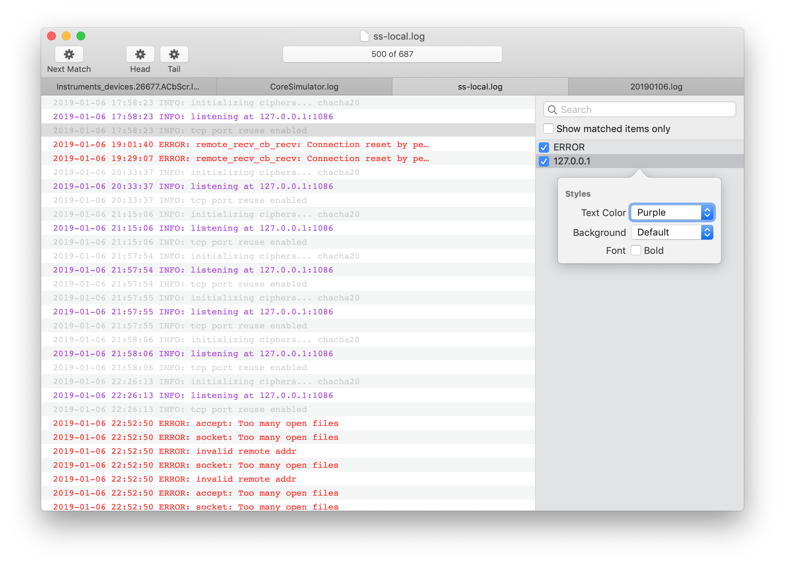

# LogDigger

The missing log viewer for macOS.

## Features
- Native Cocoa app, providing the pure Mac experience you are familiar with.
- Smooth scrolling built with `NSTableView`.
- Blazing fast large document filtering that never block your works.
- Style customization supports for filtered results.
- Jumping between filter results.
- ...ant lots of cool stuff is coming soon!

## Install

### Download Binary
[Link to the latest release](https://github.com/unixzii/LogDigger/releases)

### Build
1. `git clone https://github.com/unixzii/LogDigger.git`
2. Open **LogDigger.xcodeproj** in Xcode.
3. Build and that's it.

## Contributing
**LogDigger** is derived from our team's internal project and by far it's not quite completed. We'd love to make it open-sourced, letting the community to make it better together. All issues and pull requests are welcomed.

## License
© 2018-2019 Cyandev.

The source code is distributed under the terms of the **Apache License, Version 2.0**. See [LICENSE](https://github.com/unixzii/LogDigger/blob/master/LICENSE) for details.